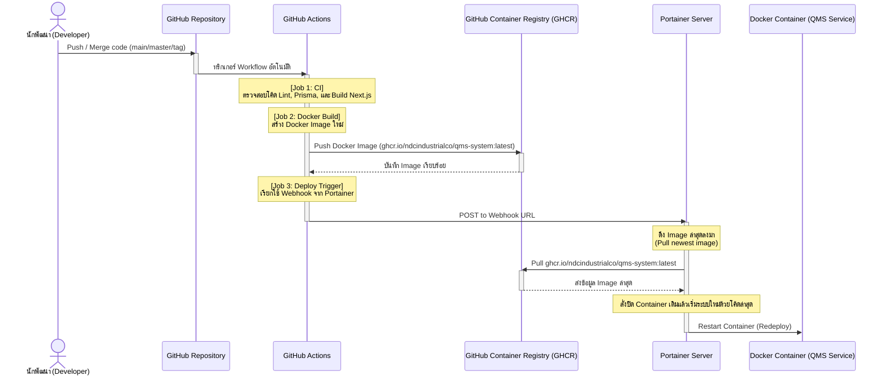

# คู่มือการตั้งค่าระบบ CI/CD ด้วย GitHub Actions และ Portainer

คู่มือฉบับนี้อธิบายกระบวนการและขั้นตอนการเชื่อมต่อ **Continuous Integration (CI)** และ **Continuous Deployment (CD)** ระหว่าง **GitHub Actions**, **GitHub Container Registry (GHCR)** และ **Portainer Webhooks** เพื่อให้ระบบทำการรีบลด์และปรับปรุงบริการใหม่โดยอัตโนมัติเมื่อมีการรวมโค้ดสำเร็จ

---

## 1. แผนผังการทำงานของระบบ (CI/CD Pipeline Flow)

การรันระบบ CI/CD ของโปรเจกต์นี้จะทำงานแบบอัตโนมัติเมื่อมีการส่งโค้ดขึ้น (Push) ไปยังสาขา `main` หรือ `master` รวมถึงเมื่อมีการติดป้ายเวอร์ชัน (Git Tag `v*`):



---

## 2. ขั้นตอนการตั้งค่าฝั่ง Portainer (Portainer Setup)

เพื่อให้เซิร์ฟเวอร์ Portainer สามารถดาวน์โหลด Docker Image และอัปเดตระบบเองได้เมื่อถูกทริกเกอร์ ให้ดำเนินการดังนี้:

### ขั้นตอนที่ 2.1: เพิ่ม Registry Credentials (GHCR) บน Portainer
เนื่องจากแพ็กเกจบน GitHub Container Registry มักจะเปิดเผยในรูปแบบกึ่งส่วนตัวหรือเป็น Private เพื่อความปลอดภัย Portainer จึงต้องใช้สิทธิ์ในการเข้าถึง:
1. ล็อกอินเข้าสู่แดชบอร์ดของ **Portainer**
2. เมนูด้านซ้าย เลือก **Settings** > **Registries**
3. คลิกปุ่ม **Add registry**
4. เลือกชนิดเป็น **Custom registry**
5. ระบุข้อมูลการเชื่อมต่อดังต่อไปนี้:
   * **Name:** `GitHub Container Registry`
   * **Registry URL:** `ghcr.io`
   * **Authentication:** เปิดใช้งาน (Toggle ON)
   * **Username:** ชื่อบัญชี GitHub ของคุณ (เช่น `ndcindustrialco`)
   * **Password / Token:** ใส่ **GitHub Personal Access Token (PAT)** *[ดูวิธีการสร้างในหัวข้อถัดไป]*
6. คลิกปุ่ม **Add registry** เพื่อยืนยัน

### ขั้นตอนที่ 2.2: เปิดใช้ Webhook ใน Stack
1. ไปที่เมนู **Stacks** ในแถบซ้ายมือของ Portainer
2. คลิกเลือก Stack ที่รันระบบ QMS System (ซึ่งใช้งานร่วมกับไฟล์ [docker-compose.yml](file:///d:/NDC_042/NextJS/qms-system/docker-compose.yml))
3. เลื่อนลงมาที่รายละเอียดของ Stack หรือในส่วนการตั้งค่าจัดการบริการ
4. ตรวจสอบให้แน่ใจว่าได้เปิดใช้งานตัวเลือก **Webhook** (Toggle ON)
5. เมื่อเปิดใช้งานแล้ว ระบบจะสร้าง **Webhook URL** ขึ้นมา ตัวอย่างเช่น:
   `https://portainer.yourdomain.com/api/stacks/webhooks/a1b2c3d4-e5f6-7a8b-9c0d-e1f2a3b4c5d6`
6. **คัดลอก (Copy) URL นี้เก็บไว้** เพื่อใช้อ้างอิงในขั้นตอนต่อไป

> [!WARNING]
> ห้ามเผยแพร่ URL นี้สู่สาธารณะโดยเด็ดขาด เนื่องจากลิงก์นี้เปิดช่องให้สั่ง Redeploy บริการของคุณจากภายนอกได้โดยไม่ต้องเข้าสู่ระบบ

---

## 3. ขั้นตอนการตั้งค่าฝั่ง GitHub (GitHub Setup)

### ขั้นตอนที่ 3.1: การนำ Webhook URL ไปใส่ใน GitHub Secrets
1. เปิดเว็บไซต์ GitHub และเข้าไปยังหน้า Repository ของ `qms-system`
2. คลิกแถบ **Settings** (ขวาบน)
3. เมนูด้านซ้าย เลือก **Secrets and variables** > **Actions**
4. คลิกปุ่ม **New repository secret**
5. ระบุค่าดังนี้:
   * **Name:** `PORTAINER_WEBHOOK_URL`
   * **Secret:** วาง **Webhook URL** ที่คัดลอกมาจากขั้นตอนใน Portainer (ข้อ 2.2)
6. คลิก **Add secret** เพื่อบันทึกค่าเก็บไว้

### ขั้นตอนที่ 3.2: วิธีสร้าง Personal Access Token (PAT)
*(กรณีที่ยังไม่มี Token สำหรับอ่านแพ็กเกจเพื่อไปใช้ในขั้นตอนที่ 2.1)*
1. ล็อกอินเข้าสู่ GitHub ไปที่ **Settings** (การตั้งค่าบัญชีส่วนตัว)
2. เลื่อนเมนูซ้ายลงมาด้านล่างสุด เลือก **Developer settings**
3. ไปที่หัวข้อ **Personal access tokens** > **Tokens (classic)**
4. คลิก **Generate new token** > เลือกแบบ **Generate new token (classic)**
5. กรอกรายละเอียด:
   * **Note:** `Portainer Read Packages Token`
   * **Scopes:** ติ๊กเลือกเฉพาะสิทธิ์ **`read:packages`** (เพื่อความปลอดภัย ไม่ต้องเลือกสิทธิ์อื่น)
6. คลิก **Generate token** ด้านล่างสุด
7. **คัดลอกรหัส Token ที่ปรากฏ** ทันที (รหัสนี้จะแสดงเพียงครั้งเดียว) แล้วนำไปวางในขั้นตอนที่ 2.1 บน Portainer

---

## 4. โครงสร้างและการทำงานของ CI/CD Workflow

สคริปต์ Workflow ของเราได้รับการตั้งค่าไว้ที่ [.github/workflows/ci-cd.yml](file:///d:/NDC_042/NextJS/qms-system/.github/workflows/ci-cd.yml) โดยประกอบด้วย 3 ส่วนหลัก (Jobs):

1. **Continuous Integration (`ci`)**: ทำหน้าที่ดาวน์โหลดโค้ด, ตรวจสอบไวยากรณ์ด้วย `npm run lint`, ตรวจสอบโครงสร้างฐานข้อมูลด้วย `npx prisma validate`, สังเคราะห์โมเดลฐานข้อมูลด้วย `npx prisma generate` และจำลองการทดสอบสร้างโปรเจกต์ Next.js จริงด้วย `npm run build` เพื่อเป็นการตรวจสอบว่าโค้ดไม่มี Error ก่อนนำไปรันบนระบบจริง
2. **Build & Push Docker Image (`docker-build-push`)**: ทำงานหลังจากขั้นตอน `ci` ผ่านแล้ว จะรันเพื่อ Build โค้ดทั้งหมดให้อยู่ในรูปของ Docker Container โดยการ Login ไปยัง Registry และอัปโหลด (Push) Image ใหม่ขึ้นไปยัง `ghcr.io/ndcindustrialco/qms-system:latest`
3. **Trigger Portainer Webhook Deploy (`deploy`)**: ยิงสัญญาณ HTTP POST ไปยัง Webhook URL ของ Portainer เพื่อสั่งให้เครื่องเซิร์ฟเวอร์ทำการดึง Image ใหม่ล่าสุดลงมาใช้งานทันที

---

## 5. การวิเคราะห์และข้อแนะนำในการย้ายโครงสร้างข้อมูล (Database Migration)

การอัปเดตระบบด้วย Docker Image บน Portainer เป็นประจำจะมีเพียงการเปลี่ยนซอร์สโค้ดของแอปพลิเคชันเท่านั้น แต่**จะไม่ดำเนินการอัปเดต Database Schema ในฐานข้อมูลจริงให้โดยอัตโนมัติ**

เพื่อป้องกันความผิดพลาดเมื่อระบบมีการเปลี่ยนโครงสร้างตารางข้อมูล (เช่น การเพิ่มฟิลด์ใหม่ในตาราง) แนะนำวิธีการรันคำสั่ง **Prisma Migration** ก่อนเริ่มรันแอปพลิเคชันดังนี้:

* **แนวทางที่แนะนำ:** เพิ่มสคริปต์สำหรับการรัน Migration ในคอนเทนเนอร์ก่อนที่จะรันคำสั่ง `next start`
* โดยใน `package.json` ให้ทำการรัน:
  ```json
  "scripts": {
    "start": "npx prisma migrate deploy && next start"
  }
  ```
  หรือสามารถรันคำสั่ง Migration ผ่าน Container Console ใน Portainer แบบ Manual ทุกครั้งหลังจากการ Deploy ที่มีการเปลี่ยนโครงสร้าง DB:
  ```bash
  npx prisma migrate deploy
  ```

---

## 6. ปัญหาที่พบบ่อย (Common Issues & Troubleshooting)

| ปัญหาที่พบ | สาเหตุที่เป็นไปได้ | แนวทางแก้ไข |
| :--- | :--- | :--- |
| **Actions ขึ้น Error `deploy` skipped / failed** | ไม่ได้ตั้งค่าตัวแปร `PORTAINER_WEBHOOK_URL` ใน GitHub Secrets | ตรวจสอบในหน้าตั้งค่า Secrets ของ GitHub Repository ว่าได้เพิ่มตัวแปรในชื่อนี้แล้วอย่างถูกต้อง |
| **Portainer ไม่สามารถดึง Image ใหม่ได้ (Authentication failed)** | พาสเวิร์ด/Token ที่ผูกกับ `ghcr.io` ใน Registry หมดอายุหรือสิทธิ์ไม่ครบ | ตรวจสอบว่า GitHub Personal Access Token บน Portainer Registry ยังใช้งานได้ปกติ และมีสิทธิ์ `read:packages` |
| **Webhook ทำงานสำเร็จ แต่ Container ไม่รีสตาร์ท** | ตัวแปร/Image ใน docker-compose ไม่ได้ชี้ไปที่ตัวล่าสุด | ตรวจสอบใน `docker-compose.yml` บน Portainer ว่ากำหนดภาพเป็น `ghcr.io/ndcindustrialco/qms-system:latest` |
| **มีผู้ใช้เข้าใช้งานพร้อมกันแล้วระบบมีปัญหา** | เครื่องเซิร์ฟเวอร์ที่รัน Portainer ขาดแคลนทรัพยากร (Memory/Disk เต็ม) | รันคำสั่ง `docker system prune -af` บนเซิร์ฟเวอร์เพื่อเคลียร์ Docker Cache และ Container เก่า ๆ ที่ตกค้าง |
